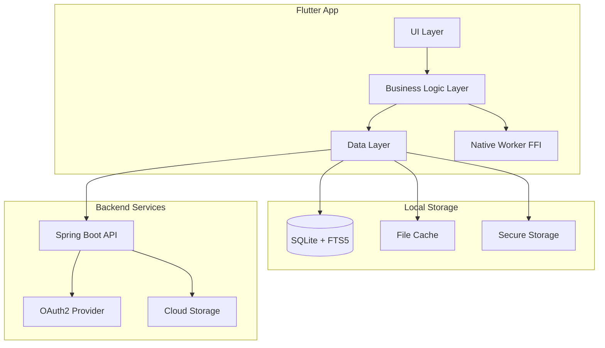

# Design Document

## Overview

The Digital Library App is a cross-platform Flutter application that provides a comprehensive digital library management and reading experience. The architecture follows a client-server model where the Flutter app handles UI, local caching, and native rendering integration, while communicating with a Java Spring Boot backend for synchronization, authentication, and cloud storage management.

The app supports both online and offline modes, with robust local caching using SQLite and native rendering workers for optimal performance across desktop (Windows, macOS, Linux) and mobile (Android, iOS) platforms.

## Architecture

### High-Level Architecture



### Layered Architecture

1. **Presentation Layer (UI)**
   - Flutter widgets and screens
   - State management (Riverpod/Provider)
   - Navigation and routing

2. **Business Logic Layer**
   - Services for core functionality
   - Background task orchestration
   - Sync and conflict resolution logic

3. **Data Layer**
   - Repository pattern for data access
   - API client for backend communication
   - Local database management

4. **Native Integration Layer**
   - FFI bindings for native rendering
   - Platform channel communication
   - Background service integration

## Backend API Integration

The Flutter app communicates with the Java Spring Boot backend through RESTful APIs as defined in the OpenAPI specification. All API calls use JWT Bearer token authentication and follow standard HTTP conventions.

### API Client Architecture

#### ApiClient
```dart
abstract class ApiClient {
  Future<T> get<T>(String path, {Map<String, dynamic>? queryParams});
  Future<T> post<T>(String path, {Object? body, Map<String, dynamic>? queryParams});
  Future<T> put<T>(String path, {Object? body});
  Future<T> delete<T>(String path);
  void setAuthToken(String token);
  void clearAuthToken();
}
```

#### API Service Implementations
Each service will use the ApiClient to communicate with backend endpoints:

- **AuthService** → `/auth/*` endpoints
- **LibraryService** → `/api/libraries/*` endpoints  
- **DocumentService** → `/api/documents/*` endpoints
- **TagService** → `/api/tags/*` endpoints
- **BookmarkService** → `/api/documents/*/bookmarks` endpoints
- **CommentService** → `/api/documents/*/comments` endpoints
- **ShareService** → `/api/shares/*` endpoints
- **SearchService** → `/api/search` endpoint
- **SyncService** → `/api/sync/*` endpoints

## Components and Interfaces

### Core Services

#### AuthService
```dart
abstract class AuthService {
  // API: POST /auth/oauth2/{provider}
  Future<AuthResult> signInWithOAuth2(String provider, String code, String state, String redirectUri);
  
  // API: POST /auth/refresh
  Future<void> refreshToken();
  
  // API: GET /api/users/me
  Future<User> getCurrentUser();
  
  Future<void> signOut();
  Stream<AuthState> get authStateStream;
  String? get currentAccessToken;
}
```

#### LibraryService
```dart
abstract class LibraryService {
  // API: GET /api/libraries
  Future<List<Library>> getLibraries();
  
  // API: POST /api/libraries
  Future<Library> addLibrary(CreateLibraryRequest request);
  
  // API: GET /api/libraries/{libraryId}
  Future<Library> getLibrary(String libraryId);
  
  // API: POST /api/libraries/{libraryId}/scan
  Future<ScanJob> scanLibrary(String libraryId);
  
  // API: DELETE /api/libraries/{libraryId}
  Future<void> deleteLibrary(String libraryId);
  
  Stream<ScanProgress> watchScanProgress(String libraryId);
}
```

#### DocumentService
```dart
abstract class DocumentService {
  // API: GET /api/documents
  Future<DocumentListResponse> getDocuments({
    String? libraryId,
    String? search,
    List<String>? tags,
    int page = 1,
    int limit = 50
  });
  
  // API: GET /api/documents/{documentId}
  Future<Document> getDocument(String documentId);
  
  // API: PUT /api/documents/{documentId}
  Future<Document> updateDocument(String documentId, UpdateDocumentRequest update);
  
  // API: DELETE /api/documents/{documentId}
  Future<void> deleteDocument(String documentId);
  
  // API: GET /api/documents/{documentId}/pages
  Future<List<Page>> getDocumentPages(String documentId);
  
  // API: GET /api/documents/{documentId}/pages/{pageNumber}
  Future<Page> getDocumentPage(String documentId, int pageNumber);
  
  // API: GET /api/documents/{documentId}/pages/{pageNumber}/text
  Future<String> getPageText(String documentId, int pageNumber);
  
  // API: POST /api/documents/{documentId}/render
  Future<RenderResponse> getPageRenderUrl(String documentId, int page, {int dpi = 150, String format = 'webp'});
}
```

#### ReaderService
```dart
abstract class ReaderService {
  // Combines API calls and native rendering
  Future<PageRenderResult> renderPage(String documentId, int pageNumber, {int dpi = 150});
  Future<String> extractPageText(String documentId, int pageNumber);
  Future<int> getPageCount(String documentId);
  
  // API: GET/POST /api/documents/{documentId}/bookmarks
  Future<void> addBookmark(String documentId, CreateBookmarkRequest request);
  Future<List<Bookmark>> getBookmarks(String documentId);
  
  // API: PUT/DELETE /api/bookmarks/{bookmarkId}
  Future<Bookmark> updateBookmark(String bookmarkId, UpdateBookmarkRequest request);
  Future<void> deleteBookmark(String bookmarkId);
  
  // API: GET/POST /api/documents/{documentId}/comments
  Future<void> addComment(String documentId, CreateCommentRequest request);
  Future<List<Comment>> getComments(String documentId, {int? pageNumber});
  
  // API: PUT/DELETE /api/comments/{commentId}
  Future<Comment> updateComment(String commentId, UpdateCommentRequest request);
  Future<void> deleteComment(String commentId);
  
  // API: GET/PUT /api/documents/{documentId}/progress
  Future<void> updateReadingProgress(String documentId, int pageNumber);
  Future<ReadingProgress?> getReadingProgress(String documentId);
}
```

#### SyncService
```dart
abstract class SyncService {
  // API: GET /api/sync/manifest
  Future<SyncManifest> getSyncManifest({DateTime? since});
  
  // API: POST /api/sync/push
  Future<SyncPushResponse> pushLocalChanges(SyncPushRequest request);
  
  Future<void> performDeltaSync({DateTime? since});
  Future<void> pushOfflineActions();
  Future<void> scheduleBackgroundSync();
  Stream<SyncStatus> get syncStatusStream;
}
```

#### SearchService
```dart
abstract class SearchService {
  // Local SQLite FTS5 search
  Future<SearchResults> searchLocal(String query, {SearchFilters? filters});
  
  // API: GET /api/search
  Future<SearchResponse> searchGlobal(String query, {
    String? libraryId,
    List<String>? tags,
    int page = 1,
    int limit = 20
  });
  
  // Combined local + global with fallback
  Future<SearchResults> searchCombined(String query, {SearchFilters? filters});
}
```

#### TagService
```dart
abstract class TagService {
  // API: GET /api/tags
  Future<List<Tag>> getTags();
  
  // API: POST /api/tags
  Future<Tag> createTag(String name);
  
  // API: DELETE /api/tags/{tagId}
  Future<void> deleteTag(String tagId);
  
  // API: POST /api/documents/{documentId}/tags
  Future<void> addTagToDocument(String documentId, String tagId);
  
  // API: DELETE /api/documents/{documentId}/tags/{tagId}
  Future<void> removeTagFromDocument(String documentId, String tagId);
  
  // API: GET /api/documents/{documentId}/tags
  Future<List<Tag>> getDocumentTags(String documentId);
  
  // Local query or API search
  Future<List<Document>> getDocumentsByTag(String tagId);
}
```

#### ShareService
```dart
abstract class ShareService {
  // API: POST /api/shares
  Future<Share> createShare(CreateShareRequest request);
  
  // API: DELETE /api/shares/{shareId}
  Future<void> deleteShare(String shareId);
  
  // API: GET /api/shares
  Future<List<Share>> getShares();
  
  // API: GET /api/shares/shared-with-me
  Future<List<Share>> getSharedWithMe();
  
  // API: PUT /api/shares/{shareId}
  Future<Share> updateSharePermission(String shareId, SharePermission permission);
}
```

### Native Worker Interface

#### NativeRenderingWorker
```dart
abstract class NativeRenderingWorker {
  Future<Uint8List> renderPage(String filePath, int page, int dpi);
  Future<String> extractText(String filePath, int page);
  Future<int> getPageCount(String filePath);
  Future<String> renderPageToCache(String filePath, int page, int dpi);
}
```

### Repository Interfaces

#### DocumentRepository
```dart
abstract class DocumentRepository {
  Future<List<Document>> findAll({DocumentQuery? query});
  Future<Document?> findById(String id);
  Future<void> save(Document document);
  Future<void> saveAll(List<Document> documents);
  Future<void> delete(String id);
  Future<List<Document>> search(String query);
}
```

#### CacheRepository
```dart
abstract class CacheRepository {
  Future<void> cachePageImage(String documentId, int page, Uint8List imageData);
  Future<Uint8List?> getCachedPageImage(String documentId, int page);
  Future<void> cacheThumbnail(String documentId, Uint8List thumbnailData);
  Future<void> evictLRU(int targetSizeBytes);
  Future<int> getCacheSize();
}
```

## Data Models

### Core Entities

#### User
```dart
class User {
  final String id; // UUID
  final String email;
  final String? name;
  final String? provider;
  final String? providerId;
  final DateTime createdAt;
}
```

#### Library
```dart
class Library {
  final String id; // UUID
  final String? ownerId;
  final String name;
  final LibraryType type; // local, gdrive, onedrive, s3
  final Map<String, dynamic>? config; // JSONB
  final DateTime createdAt;
}

enum LibraryType { local, gdrive, onedrive, s3 }
```

#### Document
```dart
class Document {
  final String id; // UUID
  final String libraryId;
  final String? title;
  final String? author;
  final String? filename;
  final String? relativePath;
  final String? fullPath;
  final String? extension;
  final String? renamedName;
  final String? isbn;
  final int? yearPublished;
  final String? status;
  final String? cloudId;
  final String? sha256;
  final int? sizeBytes;
  final int? pageCount;
  final String? format;
  final String? imageUrl;
  final String? amazonUrl;
  final String? reviewUrl;
  final Map<String, dynamic>? metadataJson;
  final DateTime createdAt;
  final DateTime updatedAt;
}
```

#### Page
```dart
class Page {
  final String id; // UUID
  final String docId;
  final int pageNumber;
  final String? textContent;
  final String? thumbnailUrl;
  final DateTime createdAt;
}
```

#### Tag
```dart
class Tag {
  final String id; // UUID
  final String? ownerId;
  final String name;
  final DateTime createdAt;
}
```

#### DocumentTag
```dart
class DocumentTag {
  final String id; // UUID
  final String docId;
  final String tagId;
  final DateTime createdAt;
}
```

#### Bookmark
```dart
class Bookmark {
  final String id; // UUID
  final String userId;
  final String docId;
  final int? pageNumber;
  final String? note;
  final DateTime createdAt;
}
```

#### Comment
```dart
class Comment {
  final String id; // UUID
  final String docId;
  final String? userId;
  final int? pageNumber;
  final Map<String, dynamic>? anchor; // JSONB for position/selection data
  final String? content;
  final DateTime createdAt;
}
```

#### Share
```dart
class Share {
  final String id; // UUID
  final String subjectId;
  final ShareSubjectType subjectType; // document, folder
  final String ownerId;
  final String? granteeEmail;
  final SharePermission permission; // view, comment, full
  final DateTime createdAt;
}

enum ShareSubjectType { document, folder }
enum SharePermission { view, comment, full }
```

#### ReadingProgress
```dart
class ReadingProgress {
  final String userId;
  final String docId;
  final int? lastPage;
  final DateTime updatedAt;
}
```

#### SyncManifest
```dart
class SyncManifest {
  final DateTime timestamp;
  final List<SyncChange> changes;
  final String checksum;
}

class SyncChange {
  final String entityType; // document, page, bookmark, comment, tag, reading_progress
  final String entityId;
  final String operation; // create, update, delete
  final Map<String, dynamic>? data;
  final DateTime timestamp;
}
```

#### API Response Models

#### AuthResult
```dart
class AuthResult {
  final String accessToken;
  final String refreshToken;
  final int expiresIn;
  final String tokenType;
}
```

#### DocumentListResponse
```dart
class DocumentListResponse {
  final List<Document> documents;
  final Pagination pagination;
}
```

#### SearchResponse
```dart
class SearchResponse {
  final List<SearchResult> results;
  final Pagination pagination;
}

class SearchResult {
  final Document document;
  final List<SearchHighlight> highlights;
}

class SearchHighlight {
  final int pageNumber;
  final String text;
  final String context;
}
```

#### RenderResponse
```dart
class RenderResponse {
  final String signedUrl;
  final DateTime expiresAt;
}
```

#### ScanJob
```dart
class ScanJob {
  final String id;
  final String libraryId;
  final String status; // pending, running, completed, failed
  final int progress; // 0-100
  final DateTime createdAt;
  final DateTime? completedAt;
}
```

#### CreateLibraryRequest
```dart
class CreateLibraryRequest {
  final String name;
  final LibraryType type;
  final Map<String, dynamic>? config;
}
```

#### UpdateDocumentRequest
```dart
class UpdateDocumentRequest {
  final String? title;
  final String? author;
  final String? renamedName;
  final String? isbn;
  final int? yearPublished;
  final Map<String, dynamic>? metadataJson;
}
```

#### CreateBookmarkRequest
```dart
class CreateBookmarkRequest {
  final int pageNumber;
  final String? note;
}
```

#### UpdateBookmarkRequest
```dart
class UpdateBookmarkRequest {
  final String? note;
}
```

#### CreateCommentRequest
```dart
class CreateCommentRequest {
  final int pageNumber;
  final Map<String, dynamic>? anchor;
  final String content;
}
```

#### UpdateCommentRequest
```dart
class UpdateCommentRequest {
  final String content;
}
```

#### CreateShareRequest
```dart
class CreateShareRequest {
  final String subjectId;
  final ShareSubjectType subjectType;
  final String granteeEmail;
  final SharePermission permission;
}
```

#### SyncPushRequest
```dart
class SyncPushRequest {
  final List<SyncChange> changes;
  final DateTime clientTimestamp;
}
```

#### SyncPushResponse
```dart
class SyncPushResponse {
  final List<String> acceptedChanges;
  final List<SyncConflict> conflicts;
  final DateTime serverTimestamp;
}

class SyncConflict {
  final String entityId;
  final String entityType;
  final Map<String, dynamic> clientVersion;
  final Map<String, dynamic> serverVersion;
  final String resolution; // server_wins, client_wins, merge_required
}
```

#### Pagination
```dart
class Pagination {
  final int page;
  final int limit;
  final int total;
  final int totalPages;
}
```

### Database Schema

#### SQLite Tables (adapted from PostgreSQL schema)
```sql
-- Users table (for local user data)
CREATE TABLE users (
  id TEXT PRIMARY KEY, -- UUID as TEXT in SQLite
  email TEXT UNIQUE NOT NULL,
  name TEXT,
  provider TEXT,
  provider_id TEXT,
  created_at INTEGER NOT NULL -- Unix timestamp
);

-- Libraries table
CREATE TABLE libraries (
  id TEXT PRIMARY KEY, -- UUID as TEXT
  owner_id TEXT REFERENCES users(id) ON DELETE SET NULL,
  name TEXT NOT NULL,
  type TEXT CHECK(type IN ('local','gdrive','onedrive','s3')) NOT NULL,
  config TEXT, -- JSON as TEXT in SQLite
  created_at INTEGER NOT NULL
);

-- Documents table
CREATE TABLE documents (
  id TEXT PRIMARY KEY, -- UUID as TEXT
  library_id TEXT REFERENCES libraries(id) ON DELETE CASCADE,
  title TEXT,
  author TEXT,
  filename TEXT,
  relative_path TEXT,
  full_path TEXT,
  extension TEXT,
  renamed_name TEXT,
  isbn TEXT,
  year_published INTEGER,
  status TEXT,
  cloud_id TEXT,
  sha256 TEXT,
  size_bytes INTEGER,
  page_count INTEGER,
  format TEXT,
  image_url TEXT,
  amazon_url TEXT,
  review_url TEXT,
  metadata_json TEXT, -- JSON as TEXT
  created_at INTEGER NOT NULL,
  updated_at INTEGER NOT NULL,
  synced_at INTEGER -- Local sync tracking
);

-- Pages table
CREATE TABLE pages (
  id TEXT PRIMARY KEY, -- UUID as TEXT
  doc_id TEXT REFERENCES documents(id) ON DELETE CASCADE,
  page_number INTEGER NOT NULL,
  text_content TEXT,
  thumbnail_url TEXT,
  created_at INTEGER NOT NULL,
  UNIQUE (doc_id, page_number)
);

-- Full-text search virtual table
CREATE VIRTUAL TABLE documents_fts USING fts5(
  title, author, text_content, tags,
  content='',
  tokenize='porter'
);

-- Tags table
CREATE TABLE tags (
  id TEXT PRIMARY KEY, -- UUID as TEXT
  owner_id TEXT REFERENCES users(id) ON DELETE SET NULL,
  name TEXT NOT NULL,
  created_at INTEGER NOT NULL,
  UNIQUE(owner_id, name)
);

-- Document tags junction table
CREATE TABLE document_tags (
  id TEXT PRIMARY KEY, -- UUID as TEXT
  doc_id TEXT REFERENCES documents(id) ON DELETE CASCADE,
  tag_id TEXT REFERENCES tags(id) ON DELETE CASCADE,
  created_at INTEGER NOT NULL,
  UNIQUE (doc_id, tag_id)
);

-- Bookmarks table
CREATE TABLE bookmarks (
  id TEXT PRIMARY KEY, -- UUID as TEXT
  user_id TEXT REFERENCES users(id) ON DELETE CASCADE,
  doc_id TEXT REFERENCES documents(id) ON DELETE CASCADE,
  page_number INTEGER,
  note TEXT,
  created_at INTEGER NOT NULL,
  synced BOOLEAN DEFAULT FALSE
);

-- Comments table
CREATE TABLE comments (
  id TEXT PRIMARY KEY, -- UUID as TEXT
  doc_id TEXT REFERENCES documents(id) ON DELETE CASCADE,
  user_id TEXT REFERENCES users(id) ON DELETE SET NULL,
  page_number INTEGER,
  anchor TEXT, -- JSON as TEXT for position/selection data
  content TEXT,
  created_at INTEGER NOT NULL,
  synced BOOLEAN DEFAULT FALSE
);

-- Shares table
CREATE TABLE shares (
  id TEXT PRIMARY KEY, -- UUID as TEXT
  subject_id TEXT,
  subject_type TEXT CHECK(subject_type IN ('document','folder')),
  owner_id TEXT REFERENCES users(id) ON DELETE CASCADE,
  grantee_email TEXT,
  permission TEXT CHECK(permission IN ('view','comment','full')),
  created_at INTEGER NOT NULL,
  synced BOOLEAN DEFAULT FALSE
);

-- Reading progress table
CREATE TABLE reading_progress (
  user_id TEXT REFERENCES users(id) ON DELETE CASCADE,
  doc_id TEXT REFERENCES documents(id) ON DELETE CASCADE,
  last_page INTEGER,
  updated_at INTEGER NOT NULL,
  synced BOOLEAN DEFAULT FALSE,
  PRIMARY KEY (user_id, doc_id)
);

-- Jobs queue for offline actions
CREATE TABLE jobs_queue (
  id TEXT PRIMARY KEY,
  type TEXT NOT NULL,
  payload TEXT NOT NULL, -- JSON
  status TEXT NOT NULL,
  created_at INTEGER NOT NULL,
  attempts INTEGER DEFAULT 0,
  last_error TEXT,
  scheduled_at INTEGER
);

-- Cache metadata table
CREATE TABLE cache_metadata (
  key TEXT PRIMARY KEY,
  size_bytes INTEGER NOT NULL,
  last_accessed INTEGER NOT NULL,
  created_at INTEGER NOT NULL
);

-- Indexes for performance
CREATE INDEX idx_documents_library_id ON documents(library_id);
CREATE INDEX idx_documents_title ON documents(title);
CREATE INDEX idx_documents_author ON documents(author);
CREATE INDEX idx_documents_updated_at ON documents(updated_at);
CREATE INDEX idx_pages_doc_id ON pages(doc_id);
CREATE INDEX idx_pages_doc_page ON pages(doc_id, page_number);
CREATE INDEX idx_bookmarks_user_doc ON bookmarks(user_id, doc_id);
CREATE INDEX idx_comments_doc_id ON comments(doc_id);
CREATE INDEX idx_reading_progress_user ON reading_progress(user_id);
CREATE INDEX idx_jobs_queue_status ON jobs_queue(status);
CREATE INDEX idx_cache_metadata_last_accessed ON cache_metadata(last_accessed);
```

## Error Handling

### Error Categories

1. **Network Errors**
   - Connection timeouts
   - Server unavailable
   - Authentication failures
   - Rate limiting

2. **File System Errors**
   - File not found
   - Permission denied
   - Disk space full
   - Corrupted files

3. **Native Worker Errors**
   - Rendering failures
   - Unsupported formats
   - Memory allocation errors
   - FFI communication errors

4. **Sync Conflicts**
   - Concurrent modifications
   - Version mismatches
   - Data corruption
   - Schema changes

### Error Handling Strategy

#### Global Error Handler
```dart
class GlobalErrorHandler {
  static void handleError(Object error, StackTrace stackTrace) {
    if (error is NetworkException) {
      _handleNetworkError(error);
    } else if (error is FileSystemException) {
      _handleFileSystemError(error);
    } else if (error is NativeWorkerException) {
      _handleNativeWorkerError(error);
    } else if (error is SyncConflictException) {
      _handleSyncConflictError(error);
    } else {
      _handleUnknownError(error, stackTrace);
    }
  }
}
```

#### Retry Mechanisms
- Exponential backoff for network requests
- Circuit breaker pattern for failing services
- Offline queue for failed sync operations
- Graceful degradation for non-critical features

#### User-Facing Error Messages
- Contextual error messages with suggested actions
- Offline indicators and sync status
- Progress indicators for long-running operations
- Fallback UI states for error conditions

## Testing Strategy

### Unit Testing
- Service layer business logic
- Repository implementations
- Data model validation
- Utility functions and helpers

### Integration Testing
- API client integration
- Database operations
- Native worker communication
- Background service functionality

### Widget Testing
- Screen rendering and navigation
- User interaction flows
- State management behavior
- Error state handling

### End-to-End Testing
- Complete user workflows
- Cross-platform compatibility
- Performance benchmarks
- Offline/online transitions

### Testing Tools and Frameworks
```yaml
dev_dependencies:
  flutter_test:
  mockito:
  integration_test:
  golden_toolkit: # for golden file testing
  patrol: # for native integration testing
```

### Test Data Management
- Mock API responses
- Sample document files
- Test database fixtures
- Isolated test environments

### Performance Testing
- Memory usage profiling
- Rendering performance benchmarks
- Database query optimization
- Cache efficiency metrics

### Security Testing
- Token storage validation
- API communication security
- File path sanitization
- Input validation testing

## Implementation Considerations

### State Management
- Use Riverpod for dependency injection and state management
- Implement proper state persistence for offline scenarios
- Handle loading, error, and success states consistently

### Background Processing
- Use Isolates for CPU-intensive tasks
- Implement proper lifecycle management for background services
- Handle platform-specific background execution limits

### Caching Strategy
- Implement LRU cache with configurable size limits
- Use WebP format for image caching
- Implement cache warming for frequently accessed content

### Performance Optimizations
- Lazy loading for large document collections
- Image preloading and caching
- Database query optimization with proper indexing
- Memory-efficient rendering pipeline

### Platform-Specific Considerations
- Desktop: File system access and window management
- Mobile: Background app refresh and battery optimization
- Cross-platform: Consistent UI/UX across platforms

### Security Measures
- Secure token storage using platform keystores
- Certificate pinning for API communications
- Input sanitization for file paths and user data
- Proper error handling without information leakage